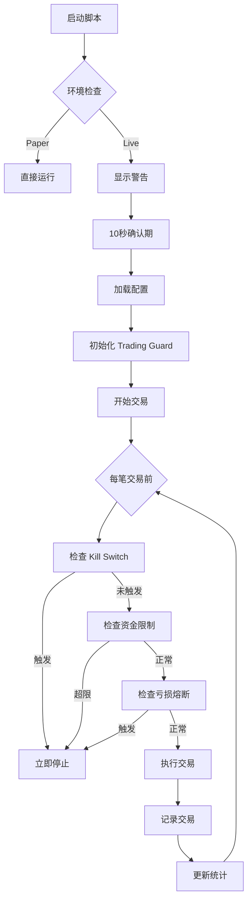

# 🚀 实盘交易准备指南

## 📋 目录

- [概述](#概述)
- [安全机制](#安全机制)
- [快速开始](#快速开始)
- [Paper Trading](#paper-trading)
- [实盘交易](#实盘交易)
- [紧急操作](#紧急操作)
- [监控与告警](#监控与告警)
- [常见问题](#常见问题)

---

## 概述

本项目已集成完整的实盘交易安全机制，包括：

- ✅ **Kill Switch** - 紧急停止开关
- ✅ **Fund Limiter** - 资金上限控制
- ✅ **Loss Circuit Breaker** - 亏损熔断器
- ✅ **环境隔离** - Paper/Live 模式区分
- ✅ **配置验证** - 防止误操作

---

## 安全机制

### 1. Kill Switch（紧急停止）

**作用**: 在任何情况下立即停止所有交易

**触发方式**:
```bash
# 方法 1: 创建 kill switch 文件
touch /tmp/poly-kill-switch

# 方法 2: 远程 SSH 触发
ssh your-server "touch /tmp/poly-kill-switch"

# 方法 3: 定时任务触发（例如每晚 6 点停止）
echo "0 18 * * * touch /tmp/poly-kill-switch" | crontab -
```

**重置**:
```bash
rm /tmp/poly-kill-switch
```

**特点**:
- 即使 SSH 断开也能远程触发
- 每 2 秒检查一次文件
- 触发后所有交易立即停止
- 需要手动重置才能恢复

---

### 2. Fund Limiter（资金上限）

**作用**: 限制交易规模，防止过度交易

**限制项目**:
- **日交易总额**: 每日累计交易金额上限
- **总持仓价值**: 同时持有的仓位总价值上限
- **单笔交易金额**: 每笔交易的最大金额
- **日交易次数**: 每日最大交易次数

**配置示例**:
```bash
MAX_DAILY_VOLUME=100        # 每日最多交易 $100
MAX_TOTAL_POSITION=500      # 总持仓不超过 $500
MAX_SINGLE_TRADE=50         # 单笔不超过 $50
```

**特点**:
- 每日 UTC 0:00 自动重置日计数器
- 达到限制自动停止交易
- 数据持久化（进程重启后恢复）

---

### 3. Loss Circuit Breaker（亏损熔断）

**作用**: 亏损达到阈值自动停止，保护本金

**熔断条件**（满足任一即触发）:
- **累计亏损**: 总亏损超过设定金额
- **单日亏损**: 当日亏损超过设定金额
- **连续亏损**: 连续亏损次数超过设定值
- **最大回撤**: 回撤百分比超过设定值

**配置示例**:
```bash
MAX_TOTAL_LOSS=100          # 累计最多亏 $100
MAX_DAILY_LOSS=50           # 单日最多亏 $50
MAX_CONSECUTIVE_LOSSES=5    # 连续亏损 5 次停止
```

**特点**:
- 触发后自动激活 Kill Switch
- 需要手动重置才能恢复
- 提供详细的触发原因和数据

---

## 快速开始

### 1. 安装依赖

```bash
cd /home/user/poly-sdk
npm install  # 或 pnpm install
```

### 2. 构建项目

```bash
npm run build
```

### 3. 配置环境

```bash
# Paper Trading
cp .env.paper .env

# 或 Live Trading（小心使用）
cp .env.live .env
# 然后编辑 .env，填入你的 PRIVATE_KEY
```

---

## Paper Trading

**推荐用途**: 策略测试、参数优化、熟悉系统

### 启动 Paper Trading

```bash
# 方法 1: 使用 .env.paper 配置
cp .env.paper .env
npx tsx scripts/endgame/v4-safe.ts

# 方法 2: 手动设置环境变量
export TRADING_MODE=paper
npx tsx scripts/endgame/v4-safe.ts

# 方法 3: 一行命令
TRADING_MODE=paper npx tsx scripts/endgame/v4-safe.ts
```

### Paper Trading 特点

- ✅ 只模拟交易，不真实下单
- ✅ 不需要私钥
- ✅ 可以使用大额测试资金
- ✅ 测试所有安全机制
- ✅ 生成真实的交易日志

### 验证清单

在转向实盘前，确保：

- [ ] 运行 Paper Trading 至少 24 小时
- [ ] 策略表现符合预期
- [ ] 测试 Kill Switch 正常工作
- [ ] 测试资金上限触发
- [ ] 测试亏损熔断触发
- [ ] 熟悉日志和报告

---

## 实盘交易

**⚠️ 警告**: 真实资金交易，请谨慎操作！

### 前置条件

- [x] Paper Trading 测试通过
- [x] 理解所有安全机制
- [x] 准备好应急预案
- [ ] 小额资金起步（$50-100）

### 小额实盘配置（推荐起步）

```bash
# .env.live
TRADING_MODE=live
PRIVATE_KEY=your_private_key_here

# 小额配置
INITIAL_CAPITAL=100
MAX_DAILY_VOLUME=50
MAX_TOTAL_POSITION=100
MAX_SINGLE_TRADE=10

# 严格风控
MAX_DAILY_LOSS=20
MAX_TOTAL_LOSS=50
MAX_CONSECUTIVE_LOSSES=3
```

### 启动实盘交易

```bash
# 1. 复制 live 配置
cp .env.live .env

# 2. 编辑 .env，填入你的 PRIVATE_KEY
nano .env

# 3. 启动（会有 10 秒确认时间）
npx tsx scripts/endgame/v4-safe.ts

# 4. 在另一个终端监控 Kill Switch
watch -n 1 "ls -lh /tmp/poly-kill-switch* 2>/dev/null || echo 'No kill switch active'"
```

### 实盘交易流程



---

## 紧急操作

### 1. 立即停止交易

```bash
# 最快方式: 触发 Kill Switch
touch /tmp/poly-kill-switch-live

# 备用方式: Ctrl+C
# 在运行脚本的终端按 Ctrl+C
```

### 2. 远程紧急停止

```bash
# SSH 到服务器触发
ssh your-server "touch /tmp/poly-kill-switch-live"

# 或使用 scp 创建文件
ssh your-server "touch /tmp/poly-kill-switch-live"
```

### 3. 定时停止（每日自动）

```bash
# 每天晚上 6 点自动停止
echo "0 18 * * * touch /tmp/poly-kill-switch-live" | crontab -

# 查看定时任务
crontab -l
```

### 4. 查看实时状态

```bash
# 监控 Kill Switch
watch -n 1 "ls -lh /tmp/poly-kill-switch* 2>/dev/null || echo 'OK'"

# 监控日志
tail -f logs/v4-live-*.csv

# 监控资金数据
watch -n 5 "cat /tmp/poly-fund-limiter.json | jq '.'"
```

---

## 监控与告警

### 实时监控脚本

```bash
#!/bin/bash
# monitor.sh - 实时监控交易状态

while true; do
  clear
  echo "═══════════════════════════════════════"
  echo "🛡️  Trading Monitor"
  echo "═══════════════════════════════════════"
  echo ""

  # Kill Switch
  if [ -f /tmp/poly-kill-switch-live ]; then
    echo "⛔ Kill Switch: ACTIVE"
  else
    echo "✅ Kill Switch: OK"
  fi

  # Fund Limiter
  if [ -f /tmp/poly-fund-limiter.json ]; then
    echo ""
    echo "💰 Fund Status:"
    cat /tmp/poly-fund-limiter.json | jq '{
      dailyVolume,
      dailyTrades,
      totalPosition
    }'
  fi

  # Loss Breaker
  if [ -f /tmp/poly-loss-breaker.json ]; then
    echo ""
    echo "🔥 Loss Breaker:"
    cat /tmp/poly-loss-breaker.json | jq '{
      isTripped,
      totalPnL,
      dailyPnL,
      consecutiveLosses
    }'
  fi

  echo ""
  echo "═══════════════════════════════════════"
  sleep 5
done
```

使用:
```bash
chmod +x monitor.sh
./monitor.sh
```

### 告警集成（可选）

#### Webhook 通知

```typescript
// 在配置中添加 webhook
const guard = new TradingGuard({
  fundLimiter: {
    onLimitReached: async (type, current, limit) => {
      await fetch('https://your-webhook-url', {
        method: 'POST',
        headers: { 'Content-Type': 'application/json' },
        body: JSON.stringify({
          alert: 'Fund Limit Reached',
          type,
          current,
          limit,
          timestamp: new Date().toISOString(),
        }),
      });
    },
  },
});
```

#### Telegram 通知

```typescript
async function sendTelegramAlert(message: string) {
  const botToken = process.env.TELEGRAM_BOT_TOKEN;
  const chatId = process.env.TELEGRAM_CHAT_ID;

  await fetch(`https://api.telegram.org/bot${botToken}/sendMessage`, {
    method: 'POST',
    headers: { 'Content-Type': 'application/json' },
    body: JSON.stringify({
      chat_id: chatId,
      text: `🚨 Trading Alert\n\n${message}`,
    }),
  });
}
```

---

## 常见问题

### Q1: Paper Trading 和 Live Trading 的区别？

**Paper Trading**:
- 只模拟交易，不下真实订单
- 不需要私钥
- 用于测试策略和参数

**Live Trading**:
- 真实交易，使用真实资金
- 需要私钥
- 所有安全机制生效

---

### Q2: Kill Switch 文件在哪里？

默认位置:
- Paper: `/tmp/poly-kill-switch-paper`
- Live: `/tmp/poly-kill-switch-live`

可以通过环境变量修改:
```bash
KILL_SWITCH_FILE=/your/custom/path
```

---

### Q3: 如何重置所有保护机制？

```typescript
// 在代码中
guard.resetAll(true);  // 需要 force=true 确认

// 或删除持久化文件
rm /tmp/poly-kill-switch*
rm /tmp/poly-fund-limiter.json
rm /tmp/poly-loss-breaker.json
```

---

### Q4: 达到限制后如何恢复？

1. **检查原因**: 查看日志和报告
2. **分析问题**: 是策略问题还是市场异常？
3. **调整配置**: 如果需要，调整限制参数
4. **重置保护**: `guard.resetAll(true)`
5. **重新启动**: 谨慎重启交易

---

### Q5: 小额实盘建议配置？

**保守配置（$50-100 起步）**:
```bash
INITIAL_CAPITAL=100
MAX_DAILY_VOLUME=50
MAX_SINGLE_TRADE=10
MAX_DAILY_LOSS=20
MAX_TOTAL_LOSS=50
MAX_CONSECUTIVE_LOSSES=3
```

**测试稳定后（$200-500）**:
```bash
INITIAL_CAPITAL=500
MAX_DAILY_VOLUME=200
MAX_SINGLE_TRADE=50
MAX_DAILY_LOSS=100
MAX_TOTAL_LOSS=200
MAX_CONSECUTIVE_LOSSES=5
```

---

### Q6: 如何查看历史交易记录？

交易记录保存在 `logs/` 目录:

```bash
# 查看最新的 CSV 文件
ls -lt logs/ | head

# 查看交易明细
cat logs/v4-live-2026-01-11T12-00-00.csv

# 分析交易（使用 csvkit）
csvstat logs/v4-live-*.csv
```

---

### Q7: 遇到网络问题怎么办？

1. **Kill Switch 仍然生效**: 本地文件检查
2. **已开仓位**:自动等待市场结束平仓
3. **无法获取新数据**: 停止新开仓

建议:
- 设置网络监控
- 使用稳定的网络环境
- 考虑使用 VPN

---

### Q8: 如何备份配置和数据？

```bash
# 备份配置
cp .env .env.backup.$(date +%Y%m%d)

# 备份日志
tar -czf logs-backup-$(date +%Y%m%d).tar.gz logs/

# 备份保护机制数据
cp /tmp/poly-*.json backups/
```

---

## 总结

### ✅ 实盘前检查清单

- [ ] Paper Trading 测试 24+ 小时
- [ ] 所有安全机制测试通过
- [ ] 理解 Kill Switch 使用方法
- [ ] 设置监控脚本
- [ ] 准备应急预案
- [ ] 小额资金起步（$50-100）
- [ ] 设置日交易限额
- [ ] 设置亏损熔断
- [ ] 测试远程紧急停止
- [ ] 记录所有配置参数

### 🎯 实盘交易原则

1. **小额起步**: $50-100 测试 1-2 天
2. **严格风控**: 不超过设定限额
3. **及时监控**: 定期查看状态
4. **快速响应**: 异常立即停止
5. **逐步放大**: 确认稳定后再增加资金

### 📞 获取帮助

- GitHub Issues: [poly-sdk/issues](https://github.com/your-repo/poly-sdk/issues)
- 文档: `/docs/`
- 示例: `/examples/`, `/scripts/`

---

**⚠️ 最后提醒**:
- 交易有风险，投资需谨慎
- 所有安全机制无法保证 100% 无风险
- 请根据自身情况合理配置参数
- 始终做好本金损失的心理准备

**祝交易顺利！** 🚀
